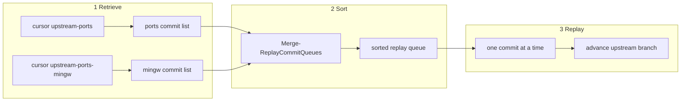
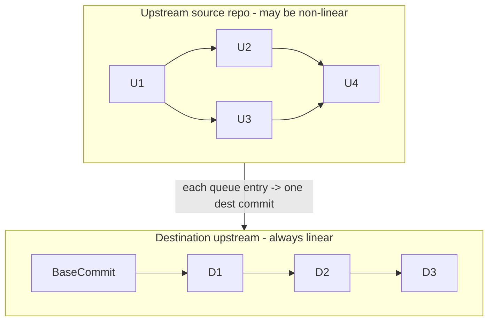
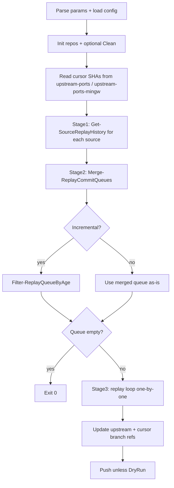

# MSYS2-UWP upstream sync plan

Sync upstream package history from [msys2/MINGW-packages](https://github.com/msys2/MINGW-packages)
and [msys2/MSYS2-packages](https://github.com/msys2/MSYS2-packages) into
[msys2-uwp/msys2-uwp](https://github.com/msys2-uwp/msys2-uwp).

## Key design change

Sync behavior is derived from **destination branch presence**:

| Condition | Behavior |
|-----------|----------|
| All three branches exist | **Incremental** -- resume from branch tips, apply age gate |
| Any branch missing | **Bootstrap** -- full replay from history root, no age gate |
| `-Clean` passed | Delete/reset all three branches first, then bootstrap |

Branches (all in `msys2-uwp/msys2-uwp`):

- `upstream` -- replayed linear history tip
- `upstream-ports` -- last replayed MSYS2-packages upstream SHA
- `upstream-ports-mingw` -- last replayed MINGW-packages upstream SHA

**Single config file.** All sync constants live in [`config/config.psd1`](../config/config.psd1) only. Scripts read via `Import-PowerShellDataFile`; they never write config. Full file content is defined in **Phase 1a** below.

**Not in config.psd1:** GitHub secrets (`MSYS2_UWP_SYNC_TOKEN`, etc.), CLI flags (`-Clean`, `-DryRun`, `-DestinationPath`, `-MaxCommits`), and ephemeral paths (default `.work/` derived in code or a single `WorkDirectory` key if needed).

---

## Sync entry point

[`scripts/Sync-Upstream.ps1`](../scripts/Sync-Upstream.ps1) -- sole script, no wrappers.

```powershell
./scripts/Sync-Upstream.ps1 `
  -DestinationPath .work/destination/msys2-uwp `
  [-Clean] `
  [-DryRun] `
  [-MaxCommits <n>] `
  [-Push]
```

| Switch | Purpose |
|--------|---------|
| `-Clean` | Remove/reset `upstream`, `upstream-ports`, `upstream-ports-mingw` in destination clone before sync |
| `-DryRun` | Replay locally, do not push |
| `-MaxCommits` | Dev throttle |
| `-Push` | Push three branches after sync (default true unless `-DryRun`) |

CI and local runs use the same invocation; first run and post-`-Clean` runs bootstrap automatically.


---

## Sync script implementation design

Single entry [`scripts/Sync-Upstream.ps1`](../scripts/Sync-Upstream.ps1) dot-sources lib modules; no other top-level scripts.

### Module layout (split Sync-Git)

```
scripts/
  Sync-Upstream.ps1         # orchestration: retrieve -> sort -> replay -> push
  lib/
    Sync-Common.ps1         # Invoke-Git, logging, paths, Parse-GitCommitObject
    Sync-Config.ps1         # Get-SyncConfig, clone URLs
    Sync-Git.ps1            # destination/mirror clone, branch refs, -Clean, push
    Sync-GitHistory.ps1    # retrieve upstream commit lists from cursor branches
    Sync-GitQueue.ps1      # merge-sort two lists into replay order
    Sync-GitReplay.ps1      # apply tree + create replay commit
```

Load order: Common -> Config -> Git -> GitHistory -> GitQueue -> GitReplay.

### Three-stage pipeline



| Stage | Module | Input | Output |
|-------|--------|-------|--------|
| **1 Retrieve** | `Sync-GitHistory.ps1` | Cursor SHAs on `upstream-ports` / `upstream-ports-mingw`; mirror tips | Two lists in **git history order** (oldest first) |
| **2 Sort** | `Sync-GitQueue.ps1` | Two lists | One merged queue in **replay rank order** |
| **3 Replay** | `Sync-GitReplay.ps1` | Merged queue + current `upstream` tip | New commits on `upstream`; updated cursor branches |

**Cursor semantics**

- `upstream-ports` HEAD = upstream SHA of the **last replayed** MSYS2-packages commit (already done).
- `upstream-ports-mingw` HEAD = same for MINGW-packages.
- **Incremental retrieve range:** `{cursorSha}..{mirrorTip}` excluding cursor itself -- only commits **not yet replayed**.
- **Full retrieve** (any of the three branches missing, or after `-Clean`): `{root}..{mirrorTip}` -- entire history for that source; cursor treated as `$null`.

Each source list is built with `git log --reverse` so commits appear in **upstream git order** (parent before child).

### Sort algorithm (replay rank merge)

**Not a global sort.** The two source lists are already ordered by upstream git history. Interleaving uses a **two-pointer merge** (same as merge step in mergesort) comparing **replay rank** of the two list heads; the smaller rank wins and advances that pointer.

**Replay rank** -- compare two entries `A` and `B` using these keys **in order**; first non-equal key decides:

| Priority | Key | Order | Notes |
|----------|-----|-------|-------|
| 1 | `CommitterDateUnix` | ASC (older first) | From upstream committer date |
| 2 | `AuthorDateUnix` | ASC | Tie-breaker |
| 3 | `SourceId` | ASC lexicographic | `ports` before `ports-mingw` |
| 4 | `Sha` | ASC hex string | Final tie-breaker |

**Pseudocode**

```
function Compare-ReplayRank(a, b):
  if a.CommitterDateUnix != b.CommitterDateUnix: return sign(a - b)
  if a.AuthorDateUnix != b.AuthorDateUnix: return sign(a - b)
  if a.SourceId != b.SourceId: return strcmp(a.SourceId, b.SourceId)
  return strcmp(a.Sha, b.Sha)

function Merge-ReplayCommitQueues(portsList, mingwList):
  result = []
  i = 0; j = 0
  while i < len(portsList) or j < len(mingwList):
    if i >= len(portsList): append mingwList[j++]; continue
    if j >= len(mingwList): append portsList[i++]; continue
    if Compare-ReplayRank(portsList[i], mingwList[j]) <= 0:
      append portsList[i++]
    else:
      append mingwList[j++]
  return result
```

**Properties**

- Relative order **within** `ports` list is preserved (stable for ports).
- Relative order **within** `ports-mingw` list is preserved.
- Cross-source order follows real-world timeline (committer date).
- Same inputs always yield the same merged queue (deterministic).

**Example** (simplified dates as integers)

| ports list | mingw list |
|------------|------------|
| P1 date=100 | M1 date=105 |
| P2 date=110 | M2 date=115 |

Merged: P1(100), M1(105), P2(110), M2(115).

If M1 date were 108: merged order is P1(100), M1(108), P2(110), M2(115) -- M1 slots between P1 and P2 by committer date.

**After sort (incremental only):** `Filter-ReplayQueueByAge` removes entries whose committer date is newer than `now - Replay.MinReplayAgeMinutes`. Full retrieve skips age filter.

### Linearizing non-linear upstream history

Upstream `msys2/*` repos can have **merge commits and branching**; destination `upstream` must stay **strictly linear** (one parent per commit). The sync does not copy upstream graph shape -- it **flattens** it into a single timeline.



**What we preserve vs what we change**

| Aspect | Upstream source | Destination `upstream` |
|--------|-----------------|------------------------|
| Graph shape | DAG, may include merges | Linear chain only |
| Commit parent | Upstream git parent(s) | Always previous `replayTip` |
| Commit order | Git topo order per source, replay-rank merge | Same order, replayed one-by-one |
| Tree content | Full repo at each upstream SHA | Combined `ports/` + `ports-mingw/` |
| Author/committer/dates | From upstream | Copied onto destination commit |

**How one upstream commit becomes one linear destination commit**

1. Index starts at **destination tree** at current `replayTip` (both subtrees as built so far).
2. Compute **upstream file delta**: `diff-tree upstreamSha^1 upstreamSha` on mirror (first parent; merge commits included in retrieve list).
3. **Rewrite paths** into that entry's `DestSubdir` only; other subdir unchanged in index.
4. Empty mapped delta + `SkipEmptyTreeDiff`: skip destination commit; still advance source cursor.
5. Else `New-ReplayCommit` with **single parent = `replayTip`**; new SHA becomes next `replayTip`.

Never `git merge` on destination; never a destination commit with two parents. Upstream merge **topology** is dropped; only **file deltas** and **metadata** are replayed.

**Disjoint subtrees (`ports` vs `ports-mingw`)**

No shared paths between sources. A ports entry touches only `ports/*`; ports-mingw only `ports-mingw/*`. Linear `upstream` is a timeline of interleaved subdirectory updates, not a merged git graph.

**Cursors vs linear tip**

- `upstream-ports` / `upstream-ports-mingw`: last **upstream SHA** processed per source.
- `upstream` tip: linear replay head on destination.
- No 1:1 SHA equality between upstream and destination commits (different parents, normalized messages).

### Data: replay commit entry

Each queue item is a hashtable (or `[PSCustomObject]`) produced by `Get-UpstreamCommitEntries`:

| Field | Type | Source |
|-------|------|--------|
| `Sha` | string | upstream full SHA |
| `SourceId` | string | `ports` or `ports-mingw` (from `Sources.*.SortKey`) |
| `CommitterDateUnix` | int | upstream committer epoch |
| `AuthorDateUnix` | int | upstream author epoch |
| `AuthorName/Email` | string | upstream |
| `CommitterName/Email` | string | upstream |
| `Subject` | string | first line of message |
| `Body` | string | rest of message (may be empty) |

No `ParentSha` on the entry. See **Linearizing non-linear upstream history** above: destination parent is always `replayTip`; upstream `sha^1` is resolved inside `Apply-UpstreamCommitToIndex` when computing the file delta.

### `Sync-Upstream.ps1` algorithm



**Step-by-step:**

1. **Params / config** -- as before.

2. **Prepare repos** -- `Sync-Git.ps1`: mirrors, destination, fetch remotes.

3. **Clean (optional)** -- `Clear-DestinationSyncBranches`.

4. **Read cursors** -- from destination branch HEADs:
   - `cursorPorts` = `Get-DestinationBranchSha(CursorPorts)` or `$null`
   - `cursorPortsMingw` = `Get-DestinationBranchSha(CursorPortsMingw)` or `$null`
   - `isFullReplay` = any of three branches missing

5. **Checkout** -- full replay: `upstream` at BaseCommit; incremental: `upstream` at current replay tip.

6. **Stage 1 -- Retrieve** (`Sync-GitHistory.ps1`)
   - `Get-SourceReplayHistory -Source Ports -AfterSha $cursorPorts -UntilSha $mirrorTip`
   - `Get-SourceReplayHistory -Source PortsMingw -AfterSha $cursorPortsMingw -UntilSha $mirrorTip`
   - Each returns `[ReplayCommitEntry[]]` in git `--reverse` order

7. **Stage 2 -- Sort** (`Sync-GitQueue.ps1`)
   - `Merge-ReplayCommitQueues -PortsList -PortsMingwList`
   - If incremental: `Filter-ReplayQueueByAge`
   - Optional `-MaxCommits` truncate

8. **Stage 3 -- Replay one-by-one** (`Sync-GitReplay.ps1`)
   - For each entry in merged queue (in order):
     - `Apply-UpstreamCommitToIndex` (skip empty diff if configured)
     - `New-ReplayCommit` (or skip commit, still track cursor for that source)
     - Advance local `replayTip`
   - Track `lastPortsSha` / `lastPortsMingwSha` per source processed

9. **Update refs** -- `Sync-Git.ps1`: set `upstream`, `upstream-ports`, `upstream-ports-mingw` branch SHAs.

10. **Push** -- `Push-DestinationBranches` unless `-DryRun`.

### Sync-GitHistory.ps1 (Phase 1b -- retrieve)

| Function | Behavior |
|----------|----------|
| `Get-SourceReplayHistory` | `git log --reverse AfterSha..UntilSha` on mirror remote; parse to `[ReplayCommitEntry]` |
| `Get-MirrorTipSha` | Current mirror `master` tip |
| `Resolve-HistoryStartSha` | `$null` cursor -> repo root; else start after cursor (exclusive) |

Optional CSV cache under `.work/cache/replay-log/` when mirror tip unchanged.

### Sync-GitQueue.ps1 (Phase 1b -- sort)

| Function | Behavior |
|----------|----------|
| `Compare-ReplayRank` | Implements 4-key comparison (see Sort algorithm above) |
| `Merge-ReplayCommitQueues` | Two-pointer merge of two history-ordered lists |
| `Filter-ReplayQueueByAge` | Incremental only; drop fresh commits |
| `Get-ReplayAgeCutoffUnix` | Cutoff epoch for age gate |

Unit tests must cover: rank comparison tie-breakers, merge stability within source, cross-source interleave, age filter.

### Sync-GitReplay.ps1 (Phase 1c -- replay one-by-one)

| Function | Behavior |
|----------|----------|
| `Format-ReplayCommitMessage` | LF-only template: `[<source-id>] <subject>\n\n<body>\nSource: msys2/<repo>@<sha>`; omit blank line before Source when body empty |
| `Format-GitReplayDateEnv` | `@<unix>` format for GIT_AUTHOR_DATE / GIT_COMMITTER_DATE |
| `Apply-UpstreamCommitToIndex` | Diff upstream commit vs its first parent on mirror (`sha^1`); map paths into one `DestSubdir` only; return `$false` if mapped diff empty |
| `New-ReplayCommit` | Parent on destination is always current `replayTip` (linear `upstream` only) |

Tree rules: prefix rewrite only; no timestamp reliance; never create merge commits on destination.

### Error handling

| Situation | Action |
|-----------|--------|
| Empty mapped diff | Skip commit; advance source cursor |
| Replay failure mid-batch | Stop; do not push; destination stays at last good local state |
| Push rejected | Fail with error; operator investigates |
| Missing BaseCommit in clone | Fetch destination repo history first; fail if still missing |
| Upstream force-push / missing SHA | Fail; human runs `-Clean` and full replay |

### Determinism

Same inputs produce identical `upstream` SHAs:

- `ReplaySpecVersion` + `config/config.psd1` path mapping
- `Destination.BaseCommit`
- Upstream mirror tips at fetch time
- Implicit full vs incremental (branch presence) affects age gate only, not order of committed entries

Full rebuild: `-Clean` then sync. Incremental at same tips adds zero commits.

### Logging

`Write-SyncLog` at INFO for: config load, branch SHAs, queue length, every 100 replay commits, push result. `-MaxCommits` logged when throttling.

---

## Script layout and phased implementation

Outer repo phases unchanged; **Phase 1** split into four sub-phases.

### Phase 1a -- Foundation (config + git workspace + destination branches)

Everything needed before replay logic: load constants, run git, open repos, read/write the three destination branches, and `-Clean`.

#### Files

| File | Role |
|------|------|
| [`config/config.psd1`](../config/config.psd1) | Fixed constants; committed directly, read-only at runtime |
| [`scripts/lib/Sync-Common.ps1`](../scripts/lib/Sync-Common.ps1) | Git shell, logging, paths |
| [`scripts/lib/Sync-Config.ps1`](../scripts/lib/Sync-Config.ps1) | Load config.psd1, URL helpers |
| [`scripts/lib/Sync-Git.ps1`](../scripts/lib/Sync-Git.ps1) | Clone, branch refs, `-Clean`, push only |

#### [`config/config.psd1`](../config/config.psd1) (committed as-is)

Edit in git only when values change (rare).

```powershell
@{
    ReplaySpecVersion = 4
    Destination = @{
        Owner            = 'msys2-uwp'
        Repo             = 'msys2-uwp'
        BaseCommit       = '6fc20894663468a04dd4986a8b1c15a9d5ae8649'
        Branches         = @{
            Replay           = 'upstream'
            CursorPorts      = 'upstream-ports'
            CursorPortsMingw = 'upstream-ports-mingw'
        }
    }
    Sources = @{
        Ports = @{
            Owner       = 'msys2'
            Repo        = 'MSYS2-packages'
            Branch      = 'master'
            DestSubdir  = 'ports'
            SortKey     = 'ports'
        }
        PortsMingw = @{
            Owner       = 'msys2'
            Repo        = 'MINGW-packages'
            Branch      = 'master'
            DestSubdir  = 'ports-mingw'
            SortKey     = 'ports-mingw'
        }
    }
    Mirrors = @{
        Owner               = 'msys2-uwp'
        Ports               = 'MSYS2-packages-mirror'
        PortsMingw          = 'MINGW-packages-mirror'
        SyncIntervalMinutes = 5
        DispatchEventType   = 'upstream-updated'
    }
    Replay = @{
        MinReplayAgeMinutes = 5
        SkipEmptyTreeDiff   = $true
        LineEnding          = 'LF'
        CommitMessagePrefix = $true
    }
    PollIntervalMinutes        = 60
    DailyReconciliationCron    = '0 3 * * *'
}
```

| Key | Purpose |
|-----|---------|
| `ReplaySpecVersion` | Algorithm version |
| `Destination.*` | Target repo, base commit, branch names |
| `Sources.*` | Upstream repos, paths, sort keys |
| `Mirrors.*` | Mirror repos, sync interval, dispatch event |
| `Replay.*` | Age gate, tree/message rules |
| `PollIntervalMinutes` | Hourly tolerance poll (60 -> cron `0 * * * *`) |
| `DailyReconciliationCron` | Daily gap-check schedule |

Read-only at runtime.

#### `Sync-Common.ps1` functions

- `Write-SyncLog`, `Get-SyncRepoRoot`, `Get-WorkDirectory`
- `Invoke-Git`, `Invoke-GitText`, `Invoke-GitStdin` -- cross-platform git wrapper
- `Set-SyncUtf8Environment`, `Clear-GitLockFiles`

#### `Sync-Config.ps1` functions

- `Get-SyncConfig` -- `Import-PowerShellDataFile` on `config/config.psd1`
- `Get-SourceCloneUrl`, `Get-DestinationCloneUrl`, `Get-MirrorCloneUrl`

#### `Sync-Git.ps1` functions (workspace + branches only)

| Function | Purpose |
|----------|---------|
| `Initialize-MirrorRepository` | Clone/fetch mirror into `.work/mirrors/<source>` |
| `Initialize-DestinationRepository` | Clone/open destination at `-DestinationPath` |
| `Add-SourceRemotesToDestination` | Add mirror remotes; `git fetch` |
| `Get-DestinationBranchSha` | `git rev-parse <branch>`; `$null` if missing |
| `Test-AllSyncBranchesExist` | True only when all three branch names resolve |
| `Set-DestinationBranchSha` | `git branch -f <branch> <sha>` |
| `Clear-DestinationSyncBranches` | **`-Clean`**: reset `upstream` to BaseCommit; delete cursor branches |
| `Push-DestinationBranches` | Push `upstream`, `upstream-ports`, `upstream-ports-mingw` |

#### `-Clean` (part of 1a)

`Clear-DestinationSyncBranches`:

1. Reset `upstream` to `Destination.BaseCommit` (or delete if base not in clone)
2. Delete `upstream-ports` and `upstream-ports-mingw` locally
3. On push: force-update remote `upstream`; delete remote cursor branches

After clean, any missing branch triggers full replay on the next sync pass.

#### Phase 1a done when

- `Get-SyncConfig` loads committed psd1
- Temp-repo test: create three branches, read SHAs, `-Clean` clears them, `Test-AllSyncBranchesExist` is false
- Can clone destination, fetch mirrors, push three branches (no replay yet)

---

### Phase 1b -- Retrieve + sort (`Sync-GitHistory.ps1`, `Sync-GitQueue.ps1`)

Implements **Stage 1** and **Stage 2** from implementation design.

- **Retrieve:** `Get-SourceReplayHistory` from `upstream-ports` / `upstream-ports-mingw` cursor SHAs to mirror tip
- **Sort:** `Compare-ReplayRank`, `Merge-ReplayCommitQueues` (4-key merge, not global sort)
- Local try-it commands: [`run-local.md`](run-local.md)
- Tests: `./tests/Test-Sync.ps1`

### Phase 1c -- Replay one-by-one (`Sync-GitReplay.ps1`)

Implements **Stage 3** from implementation design.

- `Format-ReplayCommitMessage`, `Format-GitReplayDateEnv`, `Apply-UpstreamCommitToIndex`, `New-ReplayCommit`
- Process merged queue strictly in order; one destination commit per queue entry (or skip empty diff)

### Phase 1d -- Orchestration

`Sync-Upstream.ps1` wires: retrieve -> sort -> replay -> update refs -> push (see algorithm above).

---

## Phase 2 -- GitHub Actions

CI reads timing and repo constants from [`config/config.psd1`](../config/config.psd1) (Phase 1a); workflow YAML does not duplicate them as the source of truth.

### Poll and reconciliation schedules

| config.psd1 key | Value | Workflow mapping |
|-----------------|-------|------------------|
| `PollIntervalMinutes` | `60` | Tolerance poll cron: `0 * * * *` |
| `DailyReconciliationCron` | `'0 3 * * *'` | Daily reconciliation cron (same string in YAML) |

GitHub Actions requires static cron in YAML; workflow comments reference config.psd1 as source of truth. Preflight step logs both values via `Get-SyncConfig`.

### [`sync-upstream.yml`](../.github/workflows/sync-upstream.yml) changes

| Item | Change |
|------|--------|
| Sync script | `Sync-Upstream.ps1` |
| Triggers | `repository_dispatch`, schedule, `workflow_dispatch` with optional `clean` input |
| Schedule | `# PollIntervalMinutes=60, DailyReconciliationCron in config/config.psd1` |
| Push | Three destination branches (`upstream`, `upstream-ports`, `upstream-ports-mingw`) |
| Workflows | Single `sync-upstream.yml` (fold bootstrap/rebuild/verify into dispatch inputs if needed) |

### Phase 2 done when

- Workflow runs `Sync-Upstream.ps1`; preflight logs `PollIntervalMinutes` from config
- `-Clean` available via `workflow_dispatch` input
- Trigger section documents `PollIntervalMinutes` and `DailyReconciliationCron`

---

## Docs to update

### [`AGENTS.md`](../AGENTS.md) and [`.cursor/rules/project-overview.mdc`](../.cursor/rules/project-overview.mdc)

- All sync constants in committed `config/config.psd1` only (see Phase 1a key table)
- Cursors: destination branch HEADs
- Bootstrap: implicit when branches missing; `-Clean` to reset
- Poll tolerance: `PollIntervalMinutes` in config.psd1

### Phase 2 workflow (see Phase 2 section above)

- [`sync-upstream.yml`](../.github/workflows/sync-upstream.yml): `Sync-Upstream.ps1`, preflight logs config poll values, cron comments reference config.psd1
- `workflow_dispatch` input `clean` mapped to `-Clean`

---

## Phase 1 acceptance

- Fresh destination (no branches) -> full bootstrap, three branches created
- Second run (all branches exist) -> incremental only, age gate active
- `-Clean` then run -> identical result to fresh bootstrap at same upstream tips
- Incremental at unchanged tips -> zero new commits

---

## Implementation order

1. **1a** Foundation (config + git workspace + branches + clean)
2. **1b** Queue + tests (can start in parallel once 1a Common helpers exist)
3. **1c** Replay commit (extends Sync-Git.ps1)
4. **1d** Orchestration
5. Docs pass
6. Phase 2 CI
