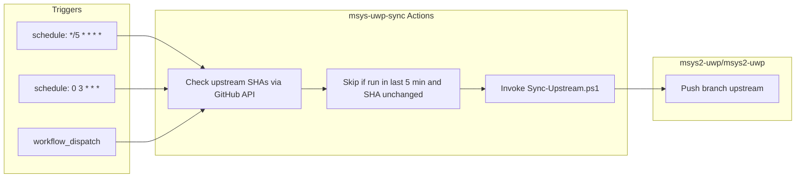

# MSYS2-UWP upstream sync plan

Sync upstream package history from [msys2/MINGW-packages](https://github.com/msys2/MINGW-packages)
and [msys2/MSYS2-packages](https://github.com/msys2/MSYS2-packages) into
[msys2-uwp/msys2-uwp](https://github.com/msys2-uwp/msys2-uwp) on branch `upstream`.

## Goals

- Cross-platform PowerShell 7 (`pwsh`) scripts runnable locally and in CI.
- Incremental sync triggered within ~5 minutes of upstream activity.
- Daily reconciliation so no commit is missed.
- Auto-push results to `msys2-uwp/msys2-uwp`.
- Preserve original commit dates when replaying history one commit at a time.
- **Deterministic replay**: re-running a full rebuild from the same upstream
  snapshot must produce the same commit order, trees, and SHAs.

## Non-goals (phase 1)

- UWP-specific patches (those live on other branches later).
- Building or validating PKGBUILDs during sync.
- Writing workflows into upstream `msys2/*` repos (we do not control them).

## Repository roles

| Repository | Role |
|------------|------|
| `msys-uwp/msys-uwp-sync` (this repo) | PowerShell sync engine, config, sync state, GitHub Actions |
| `msys2-uwp/msys2-uwp` | Destination monorepo; branch `upstream` holds replayed history only |

## Destination layout (branch `upstream`)

```
msys2-uwp/
  ports/          <-- tree from msys2/MSYS2-packages (master)
  ports-mingw/    <-- tree from msys2/MINGW-packages (master)
```

No sync metadata lives in the destination repo; it stays package content only.

## Base commit (replay root)

Replayed upstream history is **appended on top of** an existing root commit in
[msys2-uwp/msys2-uwp](https://github.com/msys2-uwp/msys2-uwp), not an orphan
branch.

| Field | Value |
|-------|-------|
| SHA | `6fc20894663468a04dd4986a8b1c15a9d5ae8649` |
| Message | `Create a git repository with empty .gitingore file.` |
| Role | Parent of the **first** replayed merge commit |

The first replayed commit must have this SHA as its sole parent. Bootstrap and
rebuild reset branch `upstream` to this commit, then replay. Incremental runs
append after the current `upstream` tip (which must descend from this base).

Configured in `config/sync.json` as `destination.baseCommit`. Do not rewrite
this commit from sync tooling.

| Upstream repo | Upstream path | Destination path |
|---------------|---------------|------------------|
| `msys2/MSYS2-packages` | `*` | `ports/*` |
| `msys2/MINGW-packages` | `*` | `ports-mingw/*` |

## Merge strategy: date-ordered replay

Upstream histories are **not** merged with `git merge`. Instead:

1. Fetch both upstream repos as read-only remotes.
2. Collect commits reachable from upstream `master` that are not yet replayed.
3. Sort pending commits by **author date** (then committer date, then SHA tie-break).
4. Replay **one commit at a time** onto `upstream`:
   - Check out parent state.
   - Apply tree changes into the mapped subdirectory only.
   - Create a commit with the **original author, author date, and message**
     (optionally prefix message with `[ports]` or `[ports-mingw]` for traceability).
5. Advance the per-repo cursor in this repo's `.sync/state.json`.
6. Push `upstream` on the destination; commit updated state to this repo.

This yields a single linear `upstream` branch whose commit timeline reflects
real upstream activity order across both repos.

## Deterministic replay (consistent history on re-do)

You will re-build the merged tree from time to time (bootstrap, rebuild after
rule changes, recovery). The replay engine must be a **pure function** of:

1. Pinned upstream commit ranges (per source ref)
2. `replaySpecVersion` in `config/sync.json` (algorithm version)
3. Path mapping (`ports/`, `ports-mingw/`)
4. `destination.baseCommit` (`6fc20894663468a04dd4986a8b1c15a9d5ae8649`)

Given the same inputs, every rebuild must yield **identical** `upstream`
history: same commit count, order, parents, trees, messages, and **SHAs**.

### Sort order (fixed tie-breakers)

All upstream commits from both sources are collected, then sorted **once**
before replay. Sort keys, in order:

| Key | Order | Notes |
|-----|-------|-------|
| Author date | ASC | Unix epoch seconds from upstream |
| Committer date | ASC | Unix epoch seconds from upstream |
| Source id | ASC | `ports` before `ports-mingw` (lexicographic) |
| Upstream full SHA | ASC | Hex string compare |

Incremental sync uses the **same sort** over the pending slice only. Because
replay is strictly append-only and cursors record upstream SHAs, incremental
runs must match what a full rebuild would have produced at the same upstream
tips.

### Commit metadata (fixed for SHA stability)

| Field | Value |
|-------|-------|
| Author name/email | Copied from upstream commit |
| Author date | Copied from upstream (`GIT_AUTHOR_DATE`) |
| Committer name/email | Fixed: `msys2-uwp-sync-bot <msys2-uwp-sync-bot@users.noreply.github.com>` |
| Committer date | **Same as author date** (never `now()`) |

Using a fixed committer identity plus author-date-as-committer-date keeps SHAs
stable across machines and CI reruns. Original upstream committer is recorded
in the `Source:` footer, not in git committer fields.

### Commit message (normalized, byte-stable)

Always use this exact template (LF line endings only):

```
[<source-id>] <upstream subject>

<upstream body, unchanged>

Source: <upstream-repo>@<upstream-full-sha>
Replayed-By: msys-uwp-sync/<replaySpecVersion>
```

- `<source-id>`: `ports` or `ports-mingw`
- `<upstream-repo>`: `msys2/MSYS2-packages` or `msys2/MINGW-packages`
- Empty upstream body: omit the blank line before `Source:`
- Merge commits: use `git diff-tree` against **first parent** only

### Tree application (deterministic)

- Map paths with a prefix rewrite only; no file content mutation.
- Use `git read-tree` / index updates; do not rely on filesystem timestamps.
- Skip commits that produce an empty tree diff after mapping (advance cursor).
- Never create merge commits on destination; always linear history.

### Modes

| Mode | When | Behavior |
|------|------|----------|
| Bootstrap | First run | Reset `upstream` to `baseCommit`, then full replay |
| Incremental | Scheduled / poll | Append pending commits after cursors |
| **Rebuild** | Manual / periodic verify | Re-play full history from pinned upstream tips; must match manifest |

**Rebuild procedure** (`Sync-Rebuild.ps1` / `-Mode Rebuild`):

1. Read pinned upstream SHAs from `config/sync.json` or `-UpstreamPin` params
   (default: current upstream branch tips at fetch time; log them).
2. Reset branch `upstream` to `destination.baseCommit` (or create `upstream`
   pointing at base if missing). For verify-only, use `upstream-verify-<id>`.
3. Run the same replay loop as bootstrap with deterministic rules above.
4. Compute manifest (see below); compare to `.sync/replay-manifest.json`.
5. On match: force-push `upstream` and update state.
6. On mismatch: fail; do not push (algorithm bug or upstream history rewrite).

### Replay manifest (verification)

Stored at `.sync/replay-manifest.json` in this repo, updated after every
successful bootstrap/rebuild:

```json
{
  "replaySpecVersion": 1,
  "baseCommit": "6fc20894663468a04dd4986a8b1c15a9d5ae8649",
  "upstreamPins": {
    "ports": "<full-sha>",
    "ports-mingw": "<full-sha>"
  },
  "commitCount": 0,
  "destinationTipSha": "<full-sha>",
  "treeRootSha": "<full-sha of ports/ + ports-mingw/ trees at tip>"
}
```

`Sync-Verify.ps1` rebuilds to a temp branch and checks `destinationTipSha` and
`commitCount` without pushing. Run after changing replay rules or before a
scheduled full rebuild.

### Upstream history rewrite

If `msys2/*` force-pushes, pinned SHAs may disappear. Recovery:

1. Human confirms new upstream tips.
2. Bump or reset cursors; update pins.
3. Run `-Mode Rebuild`; manifest will change (expected).
4. Record old manifest in `.sync/manifest-history/` for audit.

### Bootstrap vs incremental

| Mode | When | Behavior |
|------|------|----------|
| Bootstrap | First run / `Sync-Bootstrap` | Replay full history (slow; run locally or as a dedicated workflow) |
| Incremental | Every trigger after bootstrap | Replay only commits after stored cursors |
| Rebuild | Manual / verify job | Full deterministic replay; compare manifest before force-push |

Bootstrap for ~69k combined commits may take hours. Run once with progress
logging; incremental runs should finish in minutes.

## Trigger model (5-minute push awareness)

We cannot install push webhooks on `msys2/*` repos. Use **poll + debounce**:



**5-minute window**: scheduled workflow every 5 minutes compares upstream
`master` SHAs to `lastUpstreamCheck` in this repo's `.sync/state.json`. If
either SHA changed since last successful sync, run incremental replay. Use
GitHub Actions `concurrency` to cancel in-progress runs when a newer trigger
arrives (debounce overlapping work).

**Daily job**: at 03:00 UTC, force-fetch and verify cursor matches upstream
tips; replay any gap commits.

Optional later: mirror upstream repos under `msys2-uwp` and use
`repository_dispatch` from those mirrors for true push-driven triggers.

## PowerShell script layout

```
scripts/
  Sync-Upstream.ps1       # Main entry: bootstrap or incremental
  Sync-Bootstrap.ps1      # Full history replay
  Sync-Rebuild.ps1        # Deterministic full rebuild + manifest check
  Sync-Verify.ps1         # Rebuild to temp branch; compare manifest only
  Sync-Incremental.ps1    # New commits only
  lib/
    Sync-Config.ps1       # URLs, paths, branch names
    Sync-State.ps1        # Read/write .sync/state.json
    Sync-Manifest.ps1     # Read/write/compare replay-manifest.json
    Sync-Git.ps1          # Remotes, fetch, replay helpers
    Sync-GitHub.ps1       # gh/API helpers for SHA checks
config/
  sync.json               # Default config (overridable by env)
.github/
  workflows/
    sync-upstream.yml     # Scheduled + manual sync
    sync-bootstrap.yml    # Manual-only long bootstrap
```

All scripts target **PowerShell 7+** (`#requires -Version 7.0`) and use only
cmdlets plus `git` / `gh` on PATH (no Windows-only APIs).

## GitHub Actions design

### `sync-upstream.yml`

- **Triggers**: `schedule: '*/5 * * * *'`, `cron: '0 3 * * *'`, `workflow_dispatch`
- **Runner**: `ubuntu-latest` with `pwsh` (or `windows-latest`; prefer Ubuntu for git performance)
- **Concurrency**: `group: sync-upstream`, `cancel-in-progress: true`
- **Steps**:
  1. Checkout `msys-uwp-sync`
  2. Install/verify `git`, `pwsh`, `gh`
  3. Clone `msys2-uwp/msys2-uwp` with credentials
  4. Run `scripts/Sync-Upstream.ps1 -Mode Incremental`
  5. Push `upstream` on destination if commits were replayed
  6. Commit and push `.sync/state.json` to this repo when cursors changed

### `sync-bootstrap.yml`

- **Trigger**: `workflow_dispatch` only (with confirmation input)
- Same as above but `-Mode Bootstrap`

### `sync-rebuild.yml`

- **Trigger**: `workflow_dispatch` only
- Runs `-Mode Rebuild`; compares manifest; force-pushes only on match

### `sync-verify.yml`

- **Trigger**: `schedule: weekly` and `workflow_dispatch`
- Runs `Sync-Verify.ps1`; opens issue on mismatch (no push)

### Secrets (org/repo settings)

| Secret | Purpose |
|--------|---------|
| `MSYS2_UWP_SYNC_TOKEN` | PAT or GitHub App token with `contents: write` on `msys2-uwp/msys2-uwp` |

`GITHUB_TOKEN` in this repo is sufficient for reading public upstream repos.

## State file (`.sync/state.json` in this repo)

Lives at the root of **msys-uwp-sync**, committed to git. It is the sync
engine's checkpoint file, not part of the destination tree.

**What it tracks:**

| Field | Purpose |
|-------|---------|
| `lastReplayedSha` (per source) | Last upstream commit already replayed onto `upstream`; incremental sync starts after this |
| `lastUpstreamCheck` | Tip SHA seen on last poll; detects new upstream pushes without replaying |
| `lastSyncAt` | ISO timestamp of last successful sync run |
| `destinationBranchTip` | Tip SHA of destination `upstream`; must equal `replay-manifest.json` `destinationTipSha` |
| `replayManifestSha` | Hash of `.sync/replay-manifest.json` for quick CI compare |

**Why it lives here:**

- Destination repo stays clean package history only.
- CI and local runs share one cursor via git (no orphan state on the runner).
- Failed runs leave the last committed cursor intact; the next run resumes safely.

```json
{
  "version": 1,
  "destination": {
    "branch": "upstream",
    "baseCommit": "6fc20894663468a04dd4986a8b1c15a9d5ae8649"
  },
  "sources": {
    "ports": {
      "repo": "msys2/MSYS2-packages",
      "branch": "master",
      "lastReplayedSha": null
    },
    "ports-mingw": {
      "repo": "msys2/MINGW-packages",
      "branch": "master",
      "lastReplayedSha": null
    }
  },
  "destinationBranchTip": null,
  "replayManifestSha": null,
  "lastSyncAt": null,
  "lastUpstreamCheck": {
    "ports": null,
    "ports-mingw": null
  }
}
```

## Commit message convention (replayed commits)

See **Deterministic replay** above. Messages are fully normalized; do not
vary format between bootstrap, incremental, and rebuild runs.

## Error handling

| Situation | Action |
|-----------|--------|
| Empty tree change (merge commit / empty) | Skip replay, advance cursor |
| Replay failure mid-batch | Stop; do not push; leave branch consistent at last good commit |
| Push rejected (non-ff) | Fail workflow; require manual investigation |
| Rebuild manifest mismatch | Fail; do not push; investigate algorithm or upstream rewrite |
| Upstream force-push | Document recovery: reset cursor after human review |

## Implementation phases

### Phase 0 - Plan and rules (current)

- [x] `docs/PLAN.md`
- [x] Cursor rules under `.cursor/rules/`
- [x] `AGENTS.md` for agent context

### Phase 1 - Config and state library

- [x] `config/sync.json`
- [x] `scripts/lib/*.ps1` (config, state, git helpers)

### Phase 2 - Replay engine

- [x] `Sync-Bootstrap.ps1` with progress and resumable cursor
- [x] `Sync-Rebuild.ps1`, `Sync-Verify.ps1`
- [x] `Sync-Incremental.ps1`
- [x] `Sync-Upstream.ps1` dispatcher

### Phase 3 - GitHub Actions

- [x] `sync-upstream.yml` (5-min + daily)
- [x] `sync-bootstrap.yml` (manual)
- [x] `sync-rebuild.yml`, `sync-verify.yml` (manual + weekly verify)
- [ ] Wire secrets in `msys2-uwp` org

### Phase 4 - Initial bootstrap

- [ ] Run bootstrap locally or via manual workflow
- [ ] Verify `upstream` branch on `msys2-uwp/msys2-uwp`
- [ ] Enable scheduled incremental sync

## Open decisions

1. **Bootstrap location**: local machine vs self-hosted runner (large clone/time).
2. **Default branch on `msys2-uwp`**: keep `main` empty until UWP work starts, or make `upstream` default?
3. **Weekly verify schedule**: day/time for `sync-verify.yml` cron.

## Local development

```powershell
# Clone both repos
git clone https://github.com/lygstate/msys-uwp-sync  # adjust remote
cd msys-uwp-sync

# Dry run (no push)
./scripts/Sync-Upstream.ps1 -Mode Incremental -DestinationPath ../msys2-uwp -DryRun
```

Requires: PowerShell 7+, Git 2.30+, optional `gh` for API checks.
