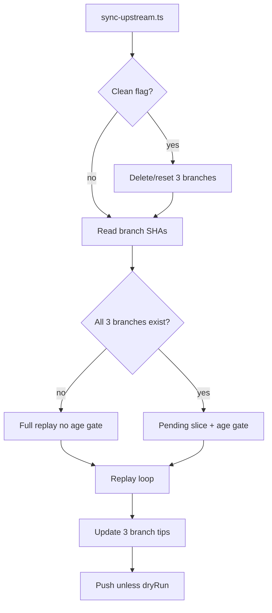
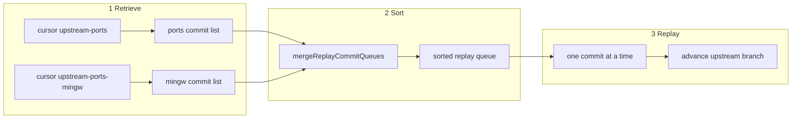
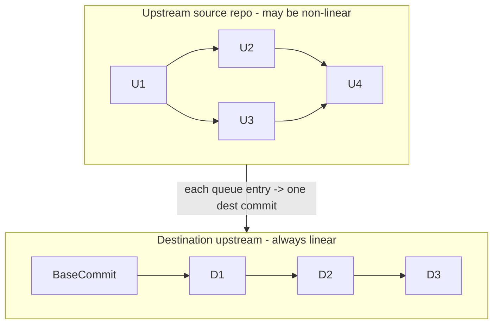

# MSYS2-UWP upstream sync plan

Sync upstream package history from [msys2/MINGW-packages](https://github.com/msys2/MINGW-packages)
and [msys2/MSYS2-packages](https://github.com/msys2/MSYS2-packages) into
[msys2-uwp/msys2-uwp](https://github.com/msys2-uwp/msys2-uwp).

## Key design change

Sync behavior is derived from **destination branch presence**:

| Condition | Behavior |
|-----------|----------|
| All three branches exist | **Incremental** -- resume from branch tips, apply age gate |
| Any branch missing | **Bootstrap** -- full replay from history root, no age gate |
| `--clean` passed | Delete/reset all three branches first, then bootstrap |

Branches (all in `msys2-uwp/msys2-uwp`):

- `upstream` -- replayed linear history tip (full merged replay progress)
- `upstream-ports` -- destination replay commit used to resume MSYS2-packages retrieve
- `upstream-ports-mingw` -- destination replay commit used to resume MINGW-packages retrieve

There is **no** separate checkpoint file. Interrupted-run state lives in these three
branches (plus the `Source: ...@<sha>` footer on cursor-branch commits).

### Interrupted-run state (destination branches, not checkpoint files)

Sync does **not** write resume state to `.work/cache/replay-log/replay-checkpoint.json`
or any similar sidecar. After each replayed queue entry (and on successful completion),
progress is stored **only** in the destination git clone:

| Branch | Stored state |
|--------|----------------|
| `upstream` | Destination replay tip (linear merged timeline) |
| `upstream-ports` | Destination commit at the fork-safe MSYS2-packages cursor |
| `upstream-ports-mingw` | Destination commit at the fork-safe MINGW-packages cursor |

**Resume flow:** re-run `yarn sync` without `--clean`. Sync reads the three branch tips,
checks out `upstream`, parses upstream mirror cursors from the `Source: msys2/<repo>@<sha>`
footer on the two cursor-branch commits (`resolveSyncRetrieveCursorsFromBranches`), and
rebuilds the merged queue from those mirror cursors to each mirror tip.

**During replay:** `upstream` advances on every successfully replayed entry. The cursor
branches advance only when `testSyncCursorBranchUpdateSafe` passes (fork-safe: every
remaining queue entry from that source must descend from the new upstream cursor in the
mirror). Empty skips and parallel fork siblings can leave cursor branches behind `upstream`
until safe to move (`advanceSyncCursorDestShasIfSafe`).

**On failure:** sync stops without push; branch tips in the local destination clone are
the resume point. **On `--clean`:** cursor branches are deleted and `upstream` is reset;
the next run bootstraps from history root.

Tests: `tests/sync/resume.test.ts`, `tests/sync/cursor-branch.test.ts`.

**Single config file.** All sync constants live in [`config/sync.json`](../config/sync.json) only.
Scripts read via `config.ts`; they never write config. Full file content is defined in
**Phase 1a** below.

**Not in sync.json:** GitHub secrets (`MSYS2_UWP_SYNC_TOKEN`, etc.), CLI flags (`--clean`,
`--dry-run`, `--destination-path`, `--max-commits`), and ephemeral paths (default `.work/`
derived in code).

---

## Runtime

Sync tooling is **TypeScript on Node.js 22.18+** (ESM). Node runs `.ts` source directly via
built-in type stripping (no `tsc` build, no `dist/`). Git operations use the `git` CLI only
(no libgit2). Cross-platform: Windows, Linux, macOS.

**Tooling:**

- Node.js native type stripping: `node src/cli/sync-upstream.ts` (enabled by default on
  Node 22.18+; on older 22.x use `--experimental-strip-types`)
- `tsconfig.json` with `noEmit: true` and `erasableSyntaxOnly: true` for editor support and
  `yarn typecheck` (`tsc --noEmit`) -- not used at runtime
- vitest for unit tests
- `child_process.spawn` or `execa` for git subprocesses
- `commander` or `yargs` for CLI flags

**TypeScript constraints (erasable syntax only):** no enums, namespaces, or parameter
properties. Use `import type`, type aliases, and interfaces only.

**ESM imports:** use `.ts` extensions in relative import paths (e.g.
`import { loadSyncConfig } from '../lib/config.ts'`).

PowerShell scripts under `scripts/` are legacy; remove after TypeScript parity is verified
(see **Implementation order**).

---

## Performance

Bootstrap replays ~69k queue entries. Slowness is dominated by **git subprocess fan-out**,
not the host language.

| Stage | Git calls | Frequency | Notes |
|-------|-----------|-----------|-------|
| Retrieve | 1x `git log` per source | Once per run | Already efficient |
| Merge-sort | 0 | Once | Pure in-memory |
| Replay (real) | ~4-5 per entry (target) | Per commit | Dominant cost |
| Dry-run | ~2 per entry | Per commit | Still heavy at 69k scale |

**Per-commit replay path (optimized target):**

1. `rev-list --parents` (mirror)
2. `diff-tree -r -z` (mirror)
3. `read-tree HEAD` (destination)
4. `update-index --index-info` (destination, stdin)
5. optional `rm --cached` (destination)
6. single `git commit` with `GIT_*` env vars and message via stdin (`-F -`)

**Optimizations to implement in TypeScript:**

| Optimization | Expected impact | Risk |
|--------------|-----------------|------|
| Replace `write-tree` + `commit-tree` + `update-ref` with single `git commit` | -3 git calls per replayed commit | Low; same tree result |
| Pass commit message via stdin instead of temp file | Removes per-commit disk I/O | Low |
| Track `replayTip` in memory; skip post-commit `rev-parse` | -1 git call per entry | Low |

Bump `ReplaySpecVersion` to 5 if commit-step optimization changes replay SHAs at same
upstream tips.

---

## Sync entry point

[`src/cli/sync-upstream.ts`](../src/cli/sync-upstream.ts) -- sole entry, no wrappers.

```bash
node src/cli/sync-upstream.ts \
  --destination-path .work/destination/msys2-uwp \
  [--clean] \
  [--dry-run] \
  [--max-commits <n>]
```

Or via `package.json` script: `yarn sync` (runs `node src/cli/sync-upstream.ts`).

| Flag | Purpose |
|------|---------|
| `--clean` | Remove/reset `upstream`, `upstream-ports`, `upstream-ports-mingw` in destination clone before sync |
| `--dry-run` | Replay locally, do not push |
| `--max-commits` | Dev throttle |
| `--skip-fetch` | Skip mirror/destination fetch |
| `--log-file` | UTF-8 log file path |
| `--log-append` | Append to log file |
| `--log-to-console` | Also print info lines when `--log-file` is set |

Push three branches after sync unless `--dry-run`. CI and local runs use the same
invocation; first run and post-`--clean` runs bootstrap automatically.



Dev helper CLIs (same runtime, optional for local debugging):

- `src/cli/fetch-mirrors.ts`
- `src/cli/retrieve-history.ts`
- `src/cli/merge-queue.ts`

---

## Sync script implementation design

Single entry `src/cli/sync-upstream.ts` imports lib modules; no other top-level sync scripts.

### Module layout

```
src/
  cli/
    sync-upstream.ts      # orchestration: retrieve -> sort -> replay -> push
    fetch-mirrors.ts
    retrieve-history.ts
    merge-queue.ts
  lib/
    git.ts                # spawn git, lock retry, UTF-8
    log.ts                # Write-SyncLog equivalent
    config.ts             # load sync.json, clone URLs
    repos.ts              # destination/mirror clone, branch refs, --clean, push
    history.ts            # retrieve upstream commit lists from cursor branches
    queue.ts              # merge-sort two lists into replay order
    replay.ts             # apply tree + create replay commit
  types/
    replay-entry.ts
tests/
  *.test.ts               # vitest unit tests
config/
  sync.json               # committed as-is; read-only at runtime
```

Import order: `git`/`log` -> `config` -> `repos` -> `history` -> `queue` -> `replay`.

### Three-stage pipeline



| Stage | Module | Input | Output |
|-------|--------|-------|--------|
| **1 Retrieve** | `history.ts` | Upstream cursors parsed from `upstream-ports` / `upstream-ports-mingw` destination commits; mirror tips | Two lists in **git history order** (oldest first) |
| **2 Sort** | `queue.ts` | Two lists | One merged queue in **replay rank order** |
| **3 Replay** | `replay.ts` | Merged queue + current `upstream` tip | New commits on `upstream`; updated cursor branches |

**Cursor semantics**

- `upstream-ports` / `upstream-ports-mingw` HEAD = destination replay commit at the current
  **fork-safe** per-source cursor (may lag `upstream` when empty skips or parallel fork
  siblings remain in the queue).
- Upstream mirror cursors for retrieve are parsed from the commit message footer on those
  branches: `Source: msys2/<repo>@<sha>` (`resolveUpstreamCursorSha`).
- **Incremental retrieve range:** `{cursorSha}..{mirrorTip}` excluding cursor itself -- only commits **not yet replayed**.
- **Full retrieve** (any of the three branches missing, or after `--clean`): `{root}..{mirrorTip}` -- entire history for that source; cursor treated as `null`.

Each source list is built with `git log --reverse` so commits appear in **upstream git order** (parent before child).

### Sort algorithm (replay rank merge)

**Not a global sort.** The two source lists are already ordered by upstream git history. Interleaving uses a **two-pointer merge** (same as merge step in mergesort) comparing **replay rank** of the two list heads; the smaller rank wins and advances that pointer.

**Replay rank** -- compare two entries `A` and `B` using these keys **in order**; first non-equal key decides:

| Priority | Key | Order | Notes |
|----------|-----|-------|-------|
| 1 | `CommitterDateUnix` | ASC (older first) | From upstream committer date |
| 2 | `AuthorDateUnix` | ASC | Tie-breaker |
| 3 | `SourceId` | ASC lexicographic | `ports` before `ports-mingw` |
| 4 | `Sha` | ASC hex string | Final tie-breaker |

**Pseudocode**

```
function compareReplayRank(a, b):
  if a.CommitterDateUnix != b.CommitterDateUnix: return sign(a - b)
  if a.AuthorDateUnix != b.AuthorDateUnix: return sign(a - b)
  if a.SourceId != b.SourceId: return strcmp(a.SourceId, b.SourceId)
  return strcmp(a.Sha, b.Sha)

function mergeReplayCommitQueues(portsList, mingwList):
  result = []
  i = 0; j = 0
  while i < len(portsList) or j < len(mingwList):
    if i >= len(portsList): append mingwList[j++]; continue
    if j >= len(mingwList): append portsList[i++]; continue
    if compareReplayRank(portsList[i], mingwList[j]) <= 0:
      append portsList[i++]
    else:
      append mingwList[j++]
  return result
```

**Properties**

- Relative order **within** `ports` list is preserved (stable for ports).
- Relative order **within** `ports-mingw` list is preserved.
- Cross-source order follows real-world timeline (committer date).
- Same inputs always yield the same merged queue (deterministic).

**Example** (simplified dates as integers)

| ports list | mingw list |
|------------|------------|
| P1 date=100 | M1 date=105 |
| P2 date=110 | M2 date=115 |

Merged: P1(100), M1(105), P2(110), M2(115).

If M1 date were 108: merged order is P1(100), M1(108), P2(110), M2(115) -- M1 slots between P1 and P2 by committer date.

**After sort (incremental only):** `filterReplayQueueByAge` removes entries whose committer date is newer than `now - Replay.MinReplayAgeMinutes`. Full retrieve skips age filter.

### Linearizing non-linear upstream history

Upstream `msys2/*` repos can have **merge commits and branching**; destination `upstream` must stay **strictly linear** (one parent per commit). The sync does not copy upstream graph shape -- it **flattens** it into a single timeline.



**What we preserve vs what we change**

| Aspect | Upstream source | Destination `upstream` |
|--------|-----------------|------------------------|
| Graph shape | DAG, may include merges | Linear chain only |
| Commit parent | Upstream git parent(s) | Always previous `replayTip` |
| Commit order | Git topo order per source, replay-rank merge | Same order, replayed one-by-one |
| Tree content | Full repo at each upstream SHA | Combined `ports/` + `ports-mingw/` |
| Author/committer/dates | From upstream | Copied onto destination commit |

**How one upstream commit becomes one linear destination commit**

1. Index starts at **destination tree** at current `replayTip` (both subtrees as built so far).
2. Compute **upstream file delta**: `diff-tree upstreamSha^1 upstreamSha` on mirror (first parent; merge commits included in retrieve list).
3. **Rewrite paths** into that entry's `DestSubdir` only; other subdir unchanged in index.
4. Empty mapped delta + `SkipEmptyTreeDiff`: skip destination commit; `upstream` unchanged for that entry; cursor branches unchanged (may lag until a later replayed entry).
5. Else `newReplayCommit` with **single parent = `replayTip`**; new SHA becomes next `replayTip`.

Never `git merge` on destination; never a destination commit with two parents. Upstream merge **topology** is dropped; only **file deltas** and **metadata** are replayed.

**Disjoint subtrees (`ports` vs `ports-mingw`)**

No shared paths between sources. A ports entry touches only `ports/*`; ports-mingw only `ports-mingw/*`. Linear `upstream` is a timeline of interleaved subdirectory updates, not a merged git graph.

**Cursors vs linear tip**

- `upstream-ports` / `upstream-ports-mingw`: destination commits at the **fork-safe**
  per-source cursor; upstream retrieve SHAs come from the `Source: ...@<sha>` footer
  (`resolveUpstreamCursorSha` / `resolveSyncRetrieveCursorsFromBranches`).
- `upstream` tip: linear replay head on destination (always the furthest merged progress).
- Cursor branches may lag `upstream` after empty skips or mid-fork replay; that is expected.
- No 1:1 SHA equality between upstream and destination commits (different parents, normalized messages).

### Data: replay commit entry

Each queue item is a `ReplayCommitEntry` produced by `getUpstreamCommitEntries`:

| Field | Type | Source |
|-------|------|--------|
| `Sha` | string | upstream full SHA |
| `SourceId` | string | `ports` or `ports-mingw` (from `Sources.*.SortKey`) |
| `CommitterDateUnix` | int | upstream committer epoch |
| `AuthorDateUnix` | int | upstream author epoch |
| `AuthorName/Email` | string | upstream |
| `CommitterName/Email` | string | upstream |
| `Subject` | string | first line of message |
| `Body` | string | rest of message (may be empty) |

No `ParentSha` on the entry. See **Linearizing non-linear upstream history** above: destination parent is always `replayTip`; upstream `sha^1` is resolved inside `applyUpstreamCommitToIndex` when computing the file delta.

### `sync-upstream.ts` algorithm


**Step-by-step:**

1. **Params / config** -- load `config/sync.json`.

2. **Prepare repos** -- `repos.ts`: mirrors, destination, fetch remotes.

3. **Clean (optional)** -- `clearDestinationSyncBranches`.

4. **Read cursors** -- from destination branch HEADs (`resolveSyncRetrieveCursorsFromBranches`):
   - Read destination SHAs on `upstream-ports` / `upstream-ports-mingw`
   - Parse upstream mirror cursors from each tip commit message (`Source: ...@<sha>`)
   - `isFullReplay` = any of three branches missing

5. **Checkout** -- full replay: `upstream` at BaseCommit; incremental: `upstream` at current replay tip.

6. **Stage 1 -- Retrieve** (`history.ts`)
   - `getSourceReplayHistory` for Ports and PortsMingw
   - Each returns `ReplayCommitEntry[]` in git `--reverse` order

7. **Stage 2 -- Sort** (`queue.ts`)
   - `mergeReplayCommitQueues`
   - If incremental: `filterReplayQueueByAge`
   - Optional `--max-commits` truncate

8. **Stage 3 -- Replay one-by-one** (`replay.ts`)
   - For each entry in merged queue (in order):
     - `applyUpstreamCommitToIndex` (skip empty diff if configured)
     - `newReplayCommit` when mapped diff non-empty (or skip commit)
     - Advance local `replayTip` on each replayed commit
     - Update `upstream` branch tip every replayed entry
     - Update `upstream-ports` / `upstream-ports-mingw` only when fork-safe
       (`testSyncCursorBranchUpdateSafe`, `advanceSyncCursorDestShasIfSafe`)

9. **Update refs** -- `repos.ts`: `updateDestinationSyncBranchRefs` sets `upstream` and
   cursor branches (cursor branches may stay at the previous fork-safe destination commit).

10. **Push** -- `pushDestinationBranches` unless `--dry-run`.

### `history.ts` (Phase 1b -- retrieve)

| Function | Behavior |
|----------|----------|
| `getSourceReplayHistory` | `git log --reverse AfterSha..UntilSha` on mirror; parse to `ReplayCommitEntry[]` |
| `getMirrorTipSha` | Current mirror `master` tip |
| `resolveHistoryStartSha` | `null` cursor -> repo root; else start after cursor (exclusive) |

Optional cache under `.work/cache/replay-log/` when mirror tip unchanged.

### `queue.ts` (Phase 1b -- sort)

| Function | Behavior |
|----------|----------|
| `compareReplayRank` | Implements 4-key comparison (see Sort algorithm above) |
| `mergeReplayCommitQueues` | Two-pointer merge of two history-ordered lists |
| `filterReplayQueueByAge` | Incremental only; drop fresh commits |
| `getReplayAgeCutoffUnix` | Cutoff epoch for age gate |
| `buildMirrorCommitParentMap` | In-memory parent map for fork-safe cursor checks |
| `testSyncCursorBranchUpdateSafe` | True when cursor branches may advance after queue index (no fork sibling left) |

Unit tests must cover: rank comparison tie-breakers, merge stability within source, cross-source interleave, age filter.

### `replay.ts` (Phase 1c -- replay one-by-one)

| Function | Behavior |
|----------|----------|
| `formatReplayCommitMessage` | LF-only template: `[<source-id>] <subject>\n\n<body>\nSource: msys2/<repo>@<sha>`; omit blank line before Source when body empty |
| `formatGitReplayDateEnv` | `@<unix>` format for GIT_AUTHOR_DATE / GIT_COMMITTER_DATE |
| `applyUpstreamCommitToIndex` | Diff upstream commit vs its first parent on mirror (`sha^1`); map paths into one `DestSubdir` only; return `false` if mapped diff empty |
| `newReplayCommit` | Parent on destination is always current `replayTip` (linear `upstream` only); prefer single `git commit` after index update |

Tree rules: prefix rewrite only; no timestamp reliance; never create merge commits on destination.

### Error handling

| Situation | Action |
|-----------|--------|
| Empty mapped diff | Skip destination commit; cursor branches unchanged until a later fork-safe replay |
| Replay failure mid-batch | Stop; do not push; destination stays at last good local state; re-run without `--clean` to continue from branch cursors |
| Push rejected | Fail with error; operator investigates |
| Missing BaseCommit in clone | Fetch destination repo history first; fail if still missing |
| Upstream force-push / missing SHA | Fail; human runs `--clean` and full replay |

### Determinism

Same inputs produce identical `upstream` SHAs:

- `ReplaySpecVersion` + `config/sync.json` path mapping
- `Destination.BaseCommit`
- Upstream mirror tips at fetch time
- Implicit full vs incremental (branch presence) affects age gate only, not order of committed entries

Full rebuild: `--clean` then sync. Incremental at same tips adds zero commits.

### Logging

`writeSyncLog` at INFO for: config load, branch SHAs, queue length, every 100 replay commits, push result. `--max-commits` logged when throttling.

`--log-file` writes UTF-8 (no BOM) log files; suppresses console info lines unless `--log-to-console`.

### Resume after interrupt

Re-run `yarn sync` **without** `--clean`. Progress is read from destination branches only
(no JSON checkpoint under `.work/`). Retrieve cursors come from `upstream-ports` and
`upstream-ports-mingw` (parse `Source: ...@<sha>` from each branch tip commit). Checkout
`upstream` from its branch tip. Cursor branches advance only at fork-safe queue positions
(all remaining entries from each source descend from that source cursor in the mirror), so
an abort mid-fork does not leave a cursor on one sibling line while the other remains. Already-replayed entries may appear again as `skip empty diff` when cursor branches lag behind skipped queue entries.

Dry-run does not modify the destination index or create commits; it only diffs upstream trees to detect empty skips.

### Text encoding (UTF-8, no loss)

All sync text I/O uses **UTF-8 without BOM** so upstream author names, emails, paths, and commit messages round-trip without mojibake.

| Layer | Handling |
|-------|----------|
| Node.js | `LANG`/`LC_ALL` = `C.UTF-8`; UTF-8 stdin/stdout/stderr on git subprocesses |
| Git subprocess | `git.ts` spawn wrapper sets UTF-8 encoding on streams |
| Git repos | `setGitRepoUtf8Encoding` on each mirror/destination clone: `i18n.logOutputEncoding`, `i18n.commitEncoding`, `core.quotepath=false` |
| Commit messages | LF-only; pass via stdin to `git commit -F -` |
| Log / cache JSON | `fs.writeFileSync` or `WriteStream` with UTF-8 no BOM |
| CI workflows | `git config --global i18n.logOutputEncoding utf-8` and `i18n.commitEncoding utf-8` in setup steps |

Git metadata is read with UTF-8 stdout. Path lists use `-z` NUL-separated git output where non-ASCII paths are possible.

---

## Script layout and phased implementation

**Phase 1** split into four sub-phases. Legacy PowerShell under `scripts/` remains until
Phase 3 parity check, then removed in Phase 4.

### Phase 0 -- Scaffold + port pure logic

- Add `package.json`, `tsconfig.json` (`noEmit`, `erasableSyntaxOnly`), vitest
- No build step; no `dist/` output
- Example `package.json` scripts:

```json
{
  "type": "module",
  "engines": { "node": ">=22.18.0" },
  "scripts": {
    "sync": "node src/cli/sync-upstream.ts",
    "fetch-mirrors": "node src/cli/fetch-mirrors.ts",
    "retrieve-history": "node src/cli/retrieve-history.ts",
    "merge-queue": "node src/cli/merge-queue.ts",
    "test": "vitest run",
    "typecheck": "tsc --noEmit"
  }
}
```

- Port unit-testable modules first (no git repo needed):
  - `compareReplayRank` / `mergeReplayCommitQueues`
  - `formatReplayCommitMessage`, `formatGitReplayDateEnv`
  - upstream commit log metadata parser
  - `parseGitCommitObject`
- Port existing unit tests to vitest; `yarn test` green

### Phase 1a -- Foundation (config + git workspace + destination branches)

Everything needed before replay logic: load constants, run git, open repos, read/write the three destination branches, and `--clean`.

#### Files

| File | Role |
|------|------|
| [`config/sync.json`](../config/sync.json) | Fixed constants; committed directly, read-only at runtime |
| [`src/lib/git.ts`](../src/lib/git.ts) | Git spawn, lock retry, UTF-8 |
| [`src/lib/log.ts`](../src/lib/log.ts) | Logging, paths |
| [`src/lib/config.ts`](../src/lib/config.ts) | Load sync.json, URL helpers |
| [`src/lib/repos.ts`](../src/lib/repos.ts) | Clone, branch refs, `--clean`, push only |

#### [`config/sync.json`](../config/sync.json) (committed as-is)

Edit in git only when values change (rare).

```json
{
  "ReplaySpecVersion": 4,
  "Destination": {
    "Owner": "msys2-uwp",
    "Repo": "msys2-uwp",
    "BaseCommit": "6fc20894663468a04dd4986a8b1c15a9d5ae8649",
    "Branches": {
      "Replay": "upstream",
      "CursorPorts": "upstream-ports",
      "CursorPortsMingw": "upstream-ports-mingw"
    }
  },
  "Sources": {
    "Ports": {
      "Owner": "msys2",
      "Repo": "MSYS2-packages",
      "Branch": "master",
      "DestSubdir": "ports",
      "SortKey": "ports"
    },
    "PortsMingw": {
      "Owner": "msys2",
      "Repo": "MINGW-packages",
      "Branch": "master",
      "DestSubdir": "ports-mingw",
      "SortKey": "ports-mingw"
    }
  },
  "Mirrors": {
    "Owner": "msys2-uwp",
    "Ports": "MSYS2-packages-mirror",
    "PortsMingw": "MINGW-packages-mirror",
    "SyncIntervalMinutes": 5,
    "DispatchEventType": "upstream-updated"
  },
  "Replay": {
    "MinReplayAgeMinutes": 5,
    "SkipEmptyTreeDiff": true,
    "LineEnding": "LF",
    "CommitMessagePrefix": true
  },
  "PollIntervalMinutes": 60,
  "DailyReconciliationCron": "0 3 * * *"
}
```

| Key | Purpose |
|-----|---------|
| `ReplaySpecVersion` | Algorithm version; bump to 5 if commit-step optimization changes replay SHAs |
| `Destination.*` | Target repo, base commit, branch names |
| `Sources.*` | Upstream repos, paths, sort keys |
| `Mirrors.*` | Mirror repos, sync interval, dispatch event |
| `Replay.*` | Age gate, tree/message rules |
| `PollIntervalMinutes` | Hourly tolerance poll (60 -> cron `0 * * * *`) |
| `DailyReconciliationCron` | Daily gap-check schedule |

Read-only at runtime.

#### `git.ts` / `log.ts` functions

- `writeSyncLog`, `getSyncRepoRoot`, `getWorkDirectory`
- `runGit`, `runGitText`, `runGitStdin` -- cross-platform git wrapper
- `setSyncUtf8Environment`, `clearGitLockFiles`

#### `config.ts` functions

- `loadSyncConfig` -- read `config/sync.json`
- `getSourceCloneUrl`, `getDestinationCloneUrl`, `getMirrorCloneUrl`

#### `repos.ts` functions (workspace + branches only)

| Function | Purpose |
|----------|---------|
| `initializeMirrorRepository` | Clone/fetch mirror into `.work/mirrors/<source>` |
| `initializeDestinationRepository` | Clone/open destination at `--destination-path` |
| `getDestinationBranchSha` | `git rev-parse <branch>`; `null` if missing |
| `testAllSyncBranchesExist` | True only when all three branch names resolve |
| `setDestinationBranchSha` | Update branch tip (checked-out branch uses `reset --hard`) |
| `resolveUpstreamCursorSha` | Parse upstream SHA from a destination replay commit message |
| `resolveSyncRetrieveCursorsFromBranches` | Read both cursor branches; return destination + upstream cursors |
| `advanceSyncCursorDestShasIfSafe` | Apply fork-safe cursor branch destination SHAs after replay |
| `updateDestinationSyncBranchRefs` | Set `upstream`, `upstream-ports`, `upstream-ports-mingw` tips |
| `clearDestinationSyncBranches` | **`--clean`**: reset `upstream` to BaseCommit; delete cursor branches |
| `pushDestinationBranches` | Push `upstream`, `upstream-ports`, `upstream-ports-mingw` |

#### `--clean` (part of 1a)

`clearDestinationSyncBranches`:

1. Reset `upstream` to `Destination.BaseCommit` (or delete if base not in clone)
2. Delete `upstream-ports` and `upstream-ports-mingw` locally
3. On push: force-update remote `upstream`; delete remote cursor branches

After clean, any missing branch triggers full replay on the next sync pass.

#### Phase 1a done when

- `loadSyncConfig` loads committed sync.json
- Temp-repo test: create three branches, read SHAs, `--clean` clears them, `testAllSyncBranchesExist` is false
- Can clone destination, fetch mirrors, push three branches (no replay yet)

---

### Phase 1b -- Retrieve + sort (`history.ts`, `queue.ts`)

Implements **Stage 1** and **Stage 2** from implementation design.

- **Retrieve:** upstream cursors from `upstream-ports` / `upstream-ports-mingw` (parse `Source: ...@<sha>`), then `getSourceReplayHistory` to mirror tip
- **Sort:** `compareReplayRank`, `mergeReplayCommitQueues` (4-key merge, not global sort)
- Local try-it commands: [`run-local.md`](run-local.md)
- Tests: `yarn test`

### Phase 1c -- Replay one-by-one (`replay.ts`)

Implements **Stage 3** from implementation design.

- `formatReplayCommitMessage`, `formatGitReplayDateEnv`, `applyUpstreamCommitToIndex`, `newReplayCommit`
- Process merged queue strictly in order; one destination commit per queue entry (or skip empty diff)
- Optimized commit path: single `git commit` after index update

### Phase 1d -- Orchestration

`sync-upstream.ts` wires: retrieve -> sort -> replay -> update refs -> push (see algorithm above).

Flags: `--clean`, `--dry-run`, `--skip-fetch`, `--max-commits`, `--log-file`, `--log-append`, `--log-to-console`.

Verify against legacy PowerShell on `--dry-run --max-commits 100` (same skip/replay decisions) before removing PS.

### Phase 4 -- Remove PowerShell + update CI/docs

- Remove `scripts/*.ps1`, `scripts/lib/*.ps1`, `tests/*.Tests.ps1`, `config/config.psd1`
- Update [`run-local.md`](run-local.md) with `yarn` commands
- Consolidate CI to single [`sync-upstream.yml`](../.github/workflows/sync-upstream.yml) calling TS CLI
- Update [`AGENTS.md`](../AGENTS.md) and cursor rules (replace `powershell-scripts.mdc` with TypeScript rules)

---

## Phase 2 -- GitHub Actions

CI reads timing and repo constants from [`config/sync.json`](../config/sync.json) (Phase 1a); workflow YAML does not duplicate them as the source of truth.

### Poll and reconciliation schedules

| sync.json key | Value | Workflow mapping |
|---------------|-------|------------------|
| `PollIntervalMinutes` | `60` | Tolerance poll cron: `0 * * * *` |
| `DailyReconciliationCron` | `'0 3 * * *'` | Daily reconciliation cron (same string in YAML) |

GitHub Actions requires static cron in YAML; workflow comments reference sync.json as source of truth. Preflight step logs both values via `loadSyncConfig`.

### [`sync-upstream.yml`](../.github/workflows/sync-upstream.yml) changes

| Item | Change |
|------|--------|
| Runtime | `actions/setup-node` (Node 22.18+), `yarn install --frozen-lockfile` |
| Sync script | `yarn sync` or `node src/cli/sync-upstream.ts` |
| Triggers | `repository_dispatch`, schedule, `workflow_dispatch` with optional `clean` input |
| Schedule | `# PollIntervalMinutes=60, DailyReconciliationCron in config/sync.json` |
| Push | Three destination branches (`upstream`, `upstream-ports`, `upstream-ports-mingw`) |
| Workflows | Single `sync-upstream.yml` (fold bootstrap/rebuild/verify into dispatch inputs if needed) |

### Phase 2 done when

- Workflow runs TypeScript sync CLI; preflight logs `PollIntervalMinutes` from config
- `--clean` available via `workflow_dispatch` input
- Trigger section documents `PollIntervalMinutes` and `DailyReconciliationCron`

---

## Docs to update

### [`AGENTS.md`](../AGENTS.md) and [`.cursor/rules/project-overview.mdc`](../.cursor/rules/project-overview.mdc)

- All sync constants in committed `config/sync.json` only (see Phase 1a key table)
- Cursors and interrupted-run state: three destination branch tips only (no checkpoint file); see **Interrupted-run state** above
- Bootstrap: implicit when branches missing; `--clean` to reset
- Poll tolerance: `PollIntervalMinutes` in sync.json
- Runtime: Node.js 22.18+, TypeScript (native type stripping), vitest

### Phase 2 workflow (see Phase 2 section above)

- [`sync-upstream.yml`](../.github/workflows/sync-upstream.yml): TypeScript sync CLI, preflight logs config poll values, cron comments reference sync.json
- `workflow_dispatch` input `clean` mapped to `--clean`

---

## Phase 1 acceptance

- Fresh destination (no branches) -> full bootstrap, three branches created
- Second run (all branches exist) -> incremental only, age gate active
- Interrupt mid-run -> re-run without `--clean`; resume from branch tips and fork-safe cursor footers
- `--clean` then run -> identical result to fresh bootstrap at same upstream tips
- Incremental at unchanged tips -> zero new commits

---

## Risks and mitigations

| Risk | Mitigation |
|------|------------|
| Replay SHA drift after `git commit` optimization | Bump `ReplaySpecVersion`; document `--clean` rebuild; compare small batches before/after |
| NUL-delimited `diff-tree -z` parsing bugs | Port parser logic literally; keep `-z` tests with non-ASCII paths |
| UTF-8 author names / commit messages | Keep `LANG=C.UTF-8`, UTF-8 stdin/stdout, LF-only messages |
| 69k-commit bootstrap runtime still hours | Set CI timeout appropriately; log commits/sec |
| Windows local dev | Node + git works on win32; test `yarn sync` locally |

---

## Implementation order

1. **0** Scaffold + port pure logic and vitest
2. **1a** Foundation (config + git workspace + branches + clean)
3. **1b** Queue + tests (can start in parallel once 1a git helpers exist)
4. **1c** Replay commit with optimized git path
5. **1d** Orchestration; parity check vs legacy PowerShell
6. **4** Remove PowerShell; docs pass
7. Phase 2 CI
