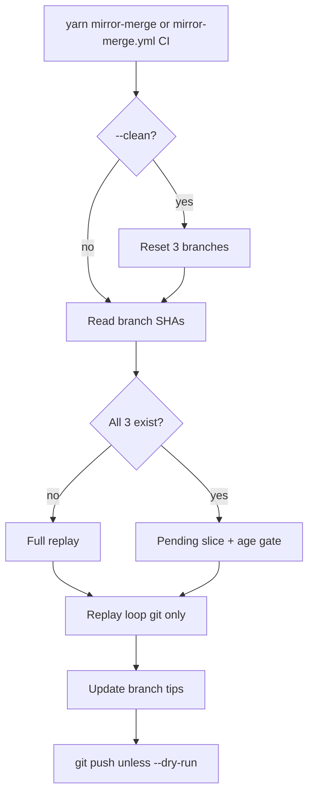

# Mirror-merge plan (Block 4; msys2-apiss-sync)

Replay upstream package history from [msys2-apiss/MSYS2-packages](https://github.com/msys2-apiss/MSYS2-packages)
and [msys2-apiss/MINGW-packages](https://github.com/msys2-apiss/MINGW-packages) into
[msys2-apiss/msys2-apiss](https://github.com/msys2-apiss/msys2-apiss) on branch
`upstream` (plus cursor branches).

**Block 4** in [`plan-workflow.md`](plan-workflow.md): replay **and** destination push
(no separate destination block).

**All tooling code lives in this repo** (`msys2-apiss-sync`). Sync orchestrates **git
subprocesses only** (no libgit2, no destination-repo workflows). Mirror refresh
(Blocks 1-3) is in [`mirror-init.md`](mirror-init.md#tooling-branch-layout) (Block 1) and
[`plan-workflow.md`](plan-workflow.md) (Blocks 2-3).

Ops: [`usage.md`](usage.md). Local testing: [`run-local.md`](run-local.md).

**Center design:** [`plan-workflow.md`](plan-workflow.md). Edit that file first for
repo/block/CI changes.

---

## Scope

| In scope | Out of scope |
|----------|----------------|
| `yarn mirror-merge` / `src/cli/sync-upstream.ts` (Block 4 local) | Cloning or updating mirror repos (Block 1) |
| [`mirror-merge.yml`](../config/mirror-template/mirror-merge.yml) on destination branch **`msys2-apiss-mirror-merge`** on **`msys2-apiss/msys2-apiss`** (Block 4 CI; installed by Block 1; [Tooling branch layout](mirror-init.md#tooling-branch-layout)) | Block 2 poll; Block 3 mirror-sync |
| Destination branches on `msys2-apiss/msys2-apiss` | Workflows on destination repo |
| Retrieve, merge-queue, replay | Workflows on mirror content branches |
| Trigger from Block 3 `workflow_dispatch_mirror_merge` (package mirrors) | |

---

## Principles

- **Minimal git surface:** read history, update index, commit, update refs, push.
  TypeScript wraps `git` only (see [`PLAN.md`](PLAN.md) for algorithm).
- **Block 4 entry points:**
  - **Local:** `yarn mirror-merge` from tooling checkout
  - **CI:** [`mirror-merge.yml`](../config/mirror-template/mirror-merge.yml) on destination repo
    **`msys2-apiss/msys2-apiss`**, branch **`msys2-apiss-mirror-merge`** (installed by Block 1;
    [Tooling branch layout](mirror-init.md#tooling-branch-layout)); triggered by Block 3
    `workflow_dispatch_mirror_merge`, cron, or manual dispatch
- **Block 3 handoff:** package mirrors dispatch destination repo after mirror `master` advances

---

## Destination branches

Sync behavior is derived from **destination branch presence**:

| Condition | Behavior |
|-----------|----------|
| All three branches exist | **Incremental** -- resume from branch tips, apply age gate |
| Any branch missing | **Bootstrap** -- full replay from history root, no age gate |
| `--clean` passed | Delete/reset all three branches first, then bootstrap |

| Branch | Role |
|--------|------|
| `upstream` | Replay tip (linear merged timeline) |
| `upstream-ports` | Cursor for MSYS2-packages retrieve (`Source: msys2/MSYS2-packages@<sha>`) |
| `upstream-ports-mingw` | Cursor for MINGW-packages retrieve |

No checkpoint file. Resume state lives in these three branches only.

**Resume:** re-run `yarn mirror-merge` or Block 4 CI without `--clean`. Parse mirror cursors from
cursor-branch commit footers; rebuild merged queue from cursors to mirror tips.

**On failure:** local destination clone branch tips are the resume point; no push.

Tests: `tests/sync/resume.test.ts`, `tests/sync/cursor-branch.test.ts`.

---

## Entry point

[`src/cli/sync-upstream.ts`](../src/cli/sync-upstream.ts) -- `yarn mirror-merge` (Block 4 local).

CI: [`mirror-merge.yml`](../config/mirror-template/mirror-merge.yml) on branch
**`msys2-apiss-mirror-merge`** ([Tooling branch layout](mirror-init.md#tooling-branch-layout)) -- same CLI, runs on GitHub Actions.

| Flag | Purpose |
|------|---------|
| `--clean` | Reset three destination branches before replay |
| `--dry-run` | Replay locally, do not push |
| `--skip-fetch` | Skip mirror/destination fetch |
| `--max-commits` | Dev throttle |
| `--destination-path` | Use existing clone (default `.work/destination/msys2-apiss`) |

Dev helpers (same pipeline, local debug only):

- `yarn retrieve-history`
- `yarn merge-queue`

Mirrors must already exist under `.work/mirrors/` (from Block 1 `yarn mirror-init`).

---

## Three-stage pipeline

1. **Retrieve** (`history.ts`) -- cursor SHAs from destination; `git log` on mirror to tip
2. **Merge-sort** (`queue.ts`) -- deterministic 4-key merge of ports + ports-mingw lists
3. **Replay** (`replay.ts`) -- apply each upstream commit to destination index; one commit per queue entry

Replay preserves upstream author/committer metadata and normalized commit message template.

---

## Operational model

Repo/block/CI map and operator flows: [`plan-workflow.md`](plan-workflow.md).

| Task | Command |
|------|---------|
| Block 4 local | `yarn mirror-merge [--skip-fetch]` |
| Block 4 CI (after Block 3 dispatch) | `gh workflow run mirror-merge.yml --repo msys2-apiss/msys2-apiss --ref msys2-apiss-mirror-merge` |
| Reset replay | `yarn mirror-merge --clean` or CI `clean=true` |

---

## Config (mirror-merge relevant keys)

From [`config/mirror-merge.json`](../config/mirror-merge.json):

| Key | Purpose |
|-----|---------|
| `Destination.*` | Target repo, base commit, branch names (`ReplayTip`: `upstream`) |
| `Sources[]` | Mirror repo names, dest subdirs, cursor branches, commit message template |
| `Replay.*` | Age gate, empty-tree skip, line endings |
| `config/mirror-poll.json` `PollIntervalMinutes` | Local tolerance poll interval (minutes) |
| `config/mirror-poll.json` `DailyReconciliationCron` | Local daily gap-check schedule |

`Sources[].Repo` names must match mirrors maintained by Block 1.
`Sources[].CursorBranch` values must match the cursor branch table above.

---

## Acceptance

- Fresh destination -> full bootstrap, three branches created (`upstream`, cursor branches)
- Second run -> incremental only, age gate active
- Interrupt mid-run -> resume without `--clean`
- `--clean` then run -> same result as fresh bootstrap at same mirror tips
- Unchanged tips -> zero new commits
- Entire replay uses git subprocesses only (Block 4)
- Destination updated by `git push` only from Block 4

---

## Implementation status

Phases 1a-1d (config, retrieve, replay, orchestration) are implemented. Pipeline status:
[`plan-workflow.md`](plan-workflow.md) (implementation status table).

Algorithm and module layout: [`PLAN.md`](PLAN.md).
