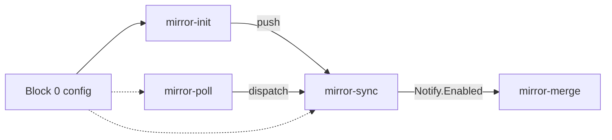

# Usage

Operator entry point for the MSYS2-APISS sync pipeline.

**Flow:** `msys2/*` upstream -> `msys2-apiss/*` mirrors -> `msys2-apiss/msys2-apiss`
on `upstream`, `upstream-ports`, `upstream-ports-mingw`.

**Runtime:** Node.js 26+, Yarn, git. TypeScript runs via Node type stripping; git
operations use the `git` CLI only.

## Pipeline

Block 0 (config) -> **1** mirror-init -> **2** mirror-poll -> **3** mirror-sync ->
**4** mirror-merge.

| Block | Doc | Entry |
|-------|-----|-------|
| 1 | [`mirror-init.md`](mirror-init.md) | `yarn mirror-init` |
| 2 | [`mirror-poll.md`](mirror-poll.md) | `yarn mirror-poll` |
| 3 | [`mirror-sync.md`](mirror-sync.md) | CI on mirror repos |
| 4 | [`mirror-merge.md`](mirror-merge.md) | `yarn mirror-merge` |



| Scenario | Blocks 1-3 | Block 4 |
|----------|------------|---------|
| Local init only | `yarn mirror-init` | -- |
| Full pipeline (local) | `yarn mirror-init --push` | or `yarn mirror-merge --skip-fetch` after mirrors advance |
| Full refresh (CI) | Block 2 cron -> Block 3 | [`mirror-merge.yml` CI](mirror-merge.md) |
| Poll only | Block 2 -> Block 3 | `yarn mirror-merge --skip-fetch` or wait for dispatch |
| Reset destination replay | -- | `yarn mirror-merge --clean` or CI `clean=true` |

All commands run from a local checkout of [`msys2-apiss/msys2-apiss-sync`](https://github.com/msys2-apiss/msys2-apiss-sync).

## GitHub (`gh`)

Block 2: [`mirror-poll.md`](mirror-poll.md). Block 3: [`mirror-sync.md`](mirror-sync.md).
Block 4: [`mirror-merge.md`](mirror-merge.md) (`mirror-merge.yml` on **`msys2-apiss-mirror-merge`**;
installed by [`mirror-init`](mirror-init.md)).

Requires the [GitHub CLI](https://cli.github.com/) (`gh auth login`) with access to
`msys2-apiss`. Local commands use **git** and **gh** only; no env secrets.
`SYNC_DISPATCH_TOKEN` and `MIRROR_PUSH_SSH_KEY` are GitHub Actions secrets on
remote repos (see below); set them with `gh secret set`.

### Setup `SYNC_DISPATCH_TOKEN`

One PAT is reused in three places:

| Where | Block | Purpose |
|-------|-------|---------|
| `msys2-apiss/msys2-apiss-sync` | Block 2 | [`mirror-poll.md`](mirror-poll.md) (`GH_TOKEN` dispatches Block 3) |
| `msys2-apiss/MSYS2-packages`, `MINGW-packages` | Block 3 | [`mirror-sync.md`](mirror-sync.md) notify step dispatches Block 4 |

Package mirrors **`MSYS2-packages`** and **`MINGW-packages`** need the secret on
the mirror repo (`Notify.Enabled: true`). The tooling repo needs the same PAT
so Block 2 can trigger Block 3 when tips differ ([`mirror-poll.md`](mirror-poll.md)).

1. **Create a PAT** ([fine-grained](https://github.com/settings/personal-access-tokens/new) recommended, or [classic](https://github.com/settings/tokens/new)):
   - **Fine-grained:** resource owner = `msys2-apiss`; repository access =
     `MSYS2-packages`, `MINGW-packages`, and `msys2-apiss-sync`; permissions:
     **Contents** Read and write, **Workflows** Read and write, **Metadata**
     Read-only.
   - **Classic:** scopes **`repo`**, **`workflow`**.
2. **Add the secret on each package mirror** and on the tooling repo (Block 2;
   see [`mirror-poll.md`](mirror-poll.md)):

```bash
gh secret set SYNC_DISPATCH_TOKEN --repo msys2-apiss/MSYS2-packages
gh secret set SYNC_DISPATCH_TOKEN --repo msys2-apiss/MINGW-packages
gh secret set SYNC_DISPATCH_TOKEN --repo msys2-apiss/msys2-apiss-sync
```

Mirror-only repos (`aports`, `glibc`, `gcc`, etc.) do not need this secret;
[`mirror-sync`](mirror-sync.md) uses `github.token` for checkout and push when the secret
is unset.

### Setup `MIRROR_PUSH_SSH_KEY` (SSH push, large mirrors)

When `PushViaSsh` is true in `config/mirror-sync/<repo>.json` (e.g. gcc). See
[`mirror-sync.md`](mirror-sync.md#ci-secrets) for which repos use SSH push.

1. **Generate a deploy key** (write access) or reuse one org-wide key pair:

```bash
ssh-keygen -t ed25519 -f mirror-push -N "" -C "msys2-apiss-mirror-push"
```

2. **Add the public key** (`mirror-push.pub`) as a **deploy key** with write
   access on each mirror repo that uses SSH push (Settings -> Deploy keys).
   The Actions secret alone is not enough; GitHub must have the matching public
   key on the repo.

```powershell
gh api repos/msys2-apiss/gcc/keys `
  -f title="mirror-push" `
  -f key="$(Get-Content -Raw mirror-push.pub)" `
  -f read_only=false
```

3. **Add the private key** as secret `MIRROR_PUSH_SSH_KEY` on those repos (or as
   an organization secret shared by all mirrors):

```powershell
Get-Content -Raw mirror-push | gh secret set MIRROR_PUSH_SSH_KEY --repo msys2-apiss/gcc
```

SSH is used only for `git push` on repos with `PushViaSsh` true.

### Refresh mirrors

See [`mirror-poll.md`](mirror-poll.md) and [`mirror-sync.md`](mirror-sync.md) for cron,
tip compare, watch runs, and manual dispatch.

### Replay destination

See [`mirror-merge.md`](mirror-merge.md) for Block 4 CI trigger, watch, and recovery.

## Local machine

Requires **Node.js 26+**, **Yarn**, **git**, and network when fetching mirrors.

### Tests

```bash
yarn test
yarn typecheck
```

### Block commands

```bash
yarn mirror-init [--repo <name>] [--skip-fetch] [--push] [--no-poll]
yarn mirror-poll [--repo <name>]
yarn mirror-merge [options]
```

Block detail: [`mirror-init.md`](mirror-init.md), [`mirror-poll.md`](mirror-poll.md),
[`mirror-merge.md`](mirror-merge.md).

Prepare mirrors locally first:

```bash
yarn mirror-init --skip-fetch
```

### Dry-run and verify (Block 4)

```bash
git clone https://github.com/msys2-apiss/msys2-apiss.git .work/destination/msys2-apiss
yarn mirror-init --skip-fetch
yarn mirror-merge --dry-run --skip-fetch --destination-path .work/destination/msys2-apiss
```

Exit 0: no mismatch. Non-zero: inspect `[sync]` output and
[`mirror-merge.md`](mirror-merge.md#operator-flows).

Throttle for dev:

```bash
yarn mirror-merge --dry-run --skip-fetch --max-commits 5
yarn mirror-merge --skip-fetch --max-commits 10 --destination-path .work/destination/msys2-apiss
```

Log capture (`--log-file` suppresses console info; warnings/errors still print;
truncate each run unless `--log-append`):

```bash
yarn mirror-merge --dry-run --skip-fetch --log-file .work/cache/replay-log/sync-dryrun.log
```

Use paths under `.work/cache/replay-log/`, not repo-root files.
